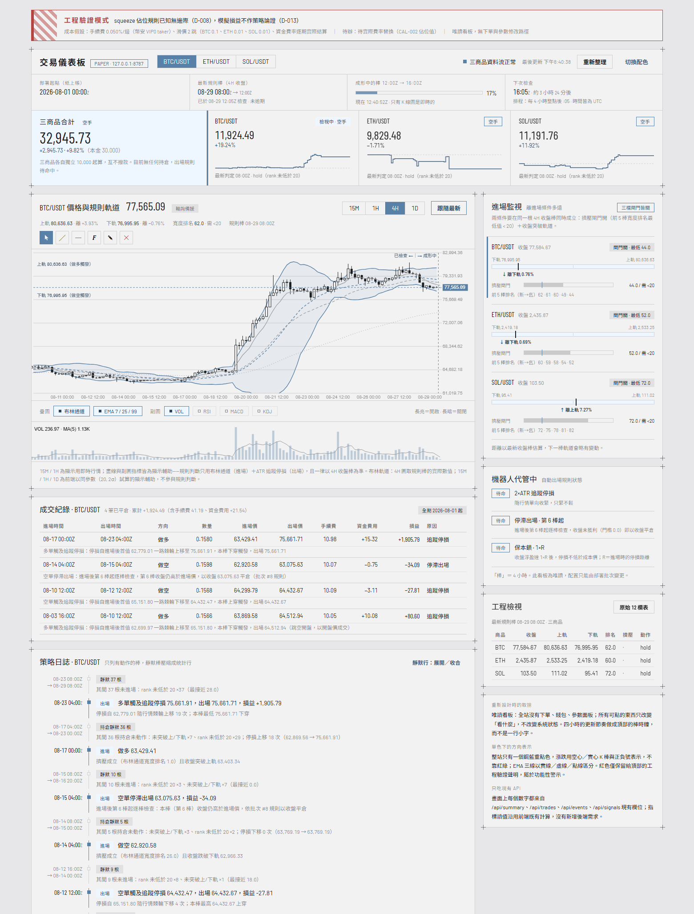

# Paper Trading Lab 加密貨幣機器人模擬交易平台

[](https://github.com/Yakitori197/yolab-paper-trading-lab/actions/workflows/tests.yml)


把**你自己的指標和參數**放進來，讓它替你跑模擬：每 4 小時抓一次幣安已收盤 K 棒，
用你的規則做全量重放，配一個唯讀儀表板——「進場監視」告訴你離**你的**進場條件還有多遠，
「機器人代管中」顯示**你的**自動出場規則正在做什麼。
不碰真錢、不接 API key、沒有任何下單路徑。

> **Paper Trading Lab** is a self-hosted crypto paper-trading workbench: plug in your own
> indicators and parameters, and it replays your rule over Binance 4h closed bars with realistic
> costs (taker fee, per-symbol tick slippage, actual funding-rate settlements), then serves a
> read-only local dashboard where the entry-watch and exit-management panels follow *your* rule.
> No real money, no API keys, no financial advice.



---

## ⚠️ 免責聲明（請先讀這段）

- 本專案**只做模擬**：不連交易所帳戶、不需要 API key、程式裡沒有任何下單路徑。
- 本專案提供的是**想法與工具，不是策略**。內建的 squeeze 突破規則只是讓管線跑起來的
  示範預設值——它準不準、賺不賺，**與本專案無關，專案不負任何責任**。
  一切輸出不構成投資建議，模擬損益不代表實盤結果。
- 歡迎 fork 走，換上你自己的規則，去實驗你自己的模擬帳戶實作。

## 換上你的指標與參數

整條管線——重放、帳目、進場監視、代管卡、策略日誌——都跟著這幾個地方走：

| 想改什麼 | 改哪裡 |
|---|---|
| **參數** | [`py/strategy_squeeze.py`](py/strategy_squeeze.py) 開頭的 `P` 字典：布林長度/倍數、擠壓門檻、ATR 長度、停損倍數 |
| **進場規則（指標）** | 同檔的 `build_signals(df, start_ms, end_ms)`：吃一個含 `ts/Open/High/Low/Close/Volume` 的 DataFrame，回傳加上 `long_sig / short_sig / atr / in_win` 四欄的副本。換掉這個函式，儀表板的進場監視就在盯你的條件 |
| **出場規則** | [`py/paper_loop.py`](py/paper_loop.py) 的 `STALL_BARS / STALL_GAIN / BE_TRIGGER`（停滯出場、保本鎖），追蹤停損倍數在 `P["stop_mult"]` |
| **幣種與資金** | 根目錄 [config.json](config.json)（見下方說明），不用動程式碼 |

改完任何規則或參數後，**刪掉 `data/paper.db` 再跑一次 tick**——全量重放會用新規則從起算日重建整本帳，新舊假設不會混在一起。

一個過來人的小建議（不強制）：先把參數定下來、跑滿一段預先決定的期間，再回頭看結果。
邊看淨值邊轉參數，得到的通常不是策略，是過擬合的曲線。

## 工作台內建的三件事

模擬最容易騙自己的三個地方，直接做進架構裡：

1. **成本誠實**——手續費 0.05%/邊（幣安 VIP0 taker）、按各幣真實跳動單位算滑價、
   資金費率取實際歷史值逐期結算（做多付正費率、做空收），不是拍腦袋的固定成本。
2. **帳目可重現**——每次都從部署起點全量重放。同樣的資料必然得到同樣的帳；
   改了規則就刪帳重來，永遠知道眼前這條淨值曲線是哪一組假設跑出來的。
3. **看板唯讀**——儀表板以 SQLite 唯讀模式（`mode=ro`）連資料庫，整個網頁沒有任何
   能改變系統狀態的按鈕。看板是觀測窗，不是控制台。

## 儀表板功能

- **棒時鐘**：部署起點、最新規則棒與檢查狀態、成形中 K 棒的即時進度條、下次檢查倒數
- **帳戶總覽**：全商品合計與各幣獨立帳（階梯式餘額走勢、最新判定一句話）
- **K 線圖**：幣安 WSS 即時行情（斷線自動降級輪詢）、15M/1H/4H/1D、
  布林規則軌道（4H 取規則棒實際數值；其他週期為同參數顯示輔助）、
  EMA/VOL/RSI/MACD/KDJ 開關、趨勢線/水平線/斐波那契/手繪畫線工具
- **進場監視**：每個幣離**你的進場條件**多遠——軌道座標尺＋閘門量表＋前 5 棒排名
- **機器人代管中**：**你的自動出場規則**即時狀態（追蹤停損、停滯出場倒數、保本鎖）
- **策略日誌**：進出場時間軸，靜默棒自動壓縮成統計行，可展開
- **成交紀錄**：含數量、手續費、資金費用與每筆的中文白話明細
- 淺色／深色雙主題、單一強調色設計（漲跌用空心/實心 K 棒表示，紅色只留給警示欄）

## 快速開始

需求：Python 3.11+、能連上幣安公開 API 的網路（**不需要**幣安帳號）。

### 1. 安裝

```bash
git clone https://github.com/Yakitori197/yolab-paper-trading-lab.git
cd yolab-paper-trading-lab
python -m venv py/.venv
# Windows:
py\.venv\Scripts\pip install -r py\requirements.txt
# Linux / macOS:
py/.venv/bin/pip install -r py/requirements.txt
```

### 2. 選你要監控的幣（可跳過，預設 BTC/ETH/SOL）

編輯根目錄的 [config.json](config.json)：

```json
{
  "symbols": [
    { "symbol": "BTC/USDT", "tick": 0.1 },
    { "symbol": "ETH/USDT", "tick": 0.01 }
  ],
  "paper_epoch": "2026-08-01 00:00",
  "cash0": 10000.0,
  "fee": 0.0005
}
```

| 欄位 | 意義 |
|---|---|
| `symbols[].symbol` | 幣安**現貨**交易對。若要結算資金費率，該幣也需有 USDT-M 永續合約（主流幣都有） |
| `symbols[].tick` | 該幣在幣安 USDS-M 期貨的最小跳動單位，用於滑價模擬（進出場各滑 2 跳） |
| `paper_epoch` | 紙上帳的起算時點（UTC）。建議設在過去 2~4 週，儀表板一開就有內容 |
| `cash0` | 每個幣各自獨立的起始資金（互不撥款） |
| `fee` | 單邊手續費率。0.0005 = 幣安 VIP0 taker；有 BNB 折扣可改 0.00045 |

> **改動任何設定後，請刪除 `data/paper.db` 再跑一次 tick**——全量重放會用新設定重建整本帳。
> 時間週期固定 4H（資金費率結算網格與規則語義都建立在 4H 收盤上），這是刻意的限制。

### 3. 首次初始化＋之後的例行更新（同一個指令）

```bash
py\.venv\Scripts\python py\paper_loop.py
```

第一次會從 2019 年起抓歷史 K 棒與資金費率（每個幣約一兩分鐘），之後每次只補新棒。
這個指令做的事：抓已收盤棒 → 全量重放 → 更新 `data/paper.db` → 印出健康檢查結果。

### 4. 開儀表板

```bash
py\.venv\Scripts\python -m uvicorn dashboard:app --app-dir py --host 127.0.0.1 --port 8787
```

瀏覽器開 http://127.0.0.1:8787 。只綁 127.0.0.1，不對外。

### 5. 排程（每 4 小時自動更新）

**Windows**：執行 `scripts\schedule_install.bat`（工作排程器，每 4 小時的 :05 跑一次）；
可另跑 `scripts\tray_install.bat` 把儀表板掛成登入自啟的系統匣圖示。

**Linux / macOS**（crontab，UTC 每 4 小時的 :05）：

```
5 0,4,8,12,16,20 * * * /path/to/yolab-paper-trading-lab/scripts/paper_tick.sh
```

儀表板則用 `scripts/dashboard.sh` 前景執行，或自行包成 systemd service。

## 架構

```
幣安公開 API（K 棒 / 資金費率 / OI）
        │  每 4 小時抓一次，斷點續傳
        ▼
data/market.db（原始市場資料，只進不改）
        │  全量重放：你的規則 + 真實成本模型
        ▼
data/paper.db（模擬帳：成交 / 逐棒訊號 / 淨值 / 狀態）
        │  SQLite 唯讀模式
        ▼
FastAPI + 單檔前端（127.0.0.1:8787，唯讀儀表板）
```

| 路徑 | 內容 |
|---|---|
| `py/paper_loop.py` | 例行 tick：抓資料 → 重放 → 寫帳 → 健康檢查 |
| `py/engine.py` | 逐棒回測引擎（進出場時序對齊 Pine 語義，含出場規則擴充） |
| `py/strategy_squeeze.py` | 示範預設規則：布林擠壓突破（**換成你的規則就從這裡**） |
| `py/dashboard.py` | 唯讀 API（FastAPI） |
| `py/static/index.html` | 儀表板前端（單檔，無建置步驟） |
| `py/fetch_*.py` | K 棒／資金費率／未平倉量收集器（可斷點續傳） |
| `tools/export_trades.py` | xlsx 帳本匯出 |
| `py/tests/` | 84 個測試，合成資料、不需網路 |

## 測試

```bash
py\.venv\Scripts\python -m pytest py\tests -q
```

84 個測試全部使用合成資料與暫存資料庫，不碰網路、不碰你的真實帳目。
CI（GitHub Actions）在每次 push 自動跑同一套。

## 出身與致謝

本專案抽取自作者的私人量化研究專案。程式註解與儀表板中出現的 `D-008`、`D-013`、
`E13`、`批次 #8` 等代號，是原專案「預先註冊研究」的決策記錄編號，保留它們作為
每個設計決定的出處——包含成本模型為何長這樣、以及預設出場規則是怎麼被檢驗過的。
儀表板 UI 以 Claude Design 設計後移植。

## License

MIT
